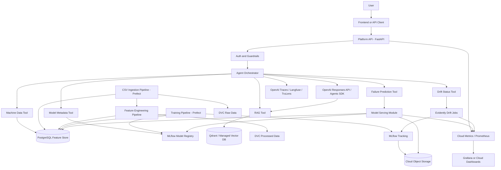

# Architecture

The platform is a cloud AI solution for predictive maintenance using the AI4I 2020 dataset.

## Component View



## User Interaction

Users interact with the LLM through the platform, not directly with OpenAI.

Primary endpoint:

```text
POST /api/v1/chat
```

Example request:

```json
{
  "message": "This machine has high torque and 190 minutes of tool wear. What is the failure risk?"
}
```

The platform API validates the request, applies guardrails, calls the agent orchestrator, and returns a structured response with generated text, model metadata, tool calls, and sources.

## Data Flow

1. A user uploads a new AI4I-compatible CSV through `/api/v1/datasets/upload`, or an operator
   places a file in `data/incoming/` during local development.
2. The API validates the uploaded CSV, stores it in the controlled incoming folder, and records
   dataset metadata in PostgreSQL.
3. The API or Prefect UI submits the incoming-ingestion deployment.
4. A Prefect ingestion flow loads the AI4I CSV or a new CSV batch.
5. Validation checks required columns, types, missing values, duplicates, and expected ranges.
6. Raw snapshots are versioned with DVC.
7. Curated records are written to PostgreSQL.
8. Feature engineering creates model-ready columns and writes a feature table.
9. Processed datasets and reference datasets are versioned with DVC.
10. Drift detection determines whether retraining should be recommended.
11. Training reads feature tables, trains candidates, evaluates them, and logs everything to MLflow.
12. MLflow Model Registry manages candidate/champion promotion.
13. Model serving loads the approved model and returns failure probability, risk class, model version, and feature context.
14. The agent uses OpenAI tool calling to request predictions, retrieve machine/model data, inspect drift, and search documentation.

## Ingestion And Drift

The initial AI4I dataset is one CSV, but the system should support future batches:

```text
data/incoming/*.csv
```

Prefect owns ingestion execution. The Platform API can accept a CSV upload and submit the
Prefect deployment, but request handling does not transform, train, or promote models directly.

The initial flow reads `data/raw/ai4i2020.csv`, validates the schema, stores curated rows and features in PostgreSQL, and records an ingestion batch. The incoming flow scans for unprocessed files, validates them, ingests them, and archives them after success.

This makes drift detection demonstrable even when the source dataset is static: the original train/reference split can be compared against holdout slices or newly supplied CSV batches.

Drift checks should compare:

- feature distributions
- target distribution when labels are available
- prediction distribution
- model performance over labeled batches

## Model Lifecycle

The lifecycle should be:

```text
data version -> feature version -> training run -> metrics -> MLflow artifacts
-> registry candidate -> validation gate -> approval -> production alias/stage -> serving
```

Primary task:

```text
binary classification: Machine failure = 0/1
```

Optional tasks:

```text
failure-mode diagnostics for TWF, HDF, PWF, OSF, RNF
```

## Runtime APIs

Expected public API groups:

- `/health`
- `/chat`
- `/predictions`
- `/machines`
- `/models`
- `/rag`
- `/monitoring`

Prediction responses should expose model version, failure probability, risk class, top contributing features when available, data version, and limitations.

## Deployment

The cloud deployment should include:

- platform API
- dedicated platform API image
- PostgreSQL
- MLflow tracking and registry
- cloud object storage for MLflow artifacts and DVC remotes
- OpenAI API integration
- Qdrant or managed vector database
- Prefect server/cloud and dedicated worker image
- Prometheus/Grafana or cloud-native metrics
- Evidently drift jobs
- OpenAI traces, Langfuse, or TruLens
- cloud IAM/OIDC and API gateway

Container deployment can use a cloud container platform such as Cloud Run, ECS/Fargate, Azure Container Apps, Kubernetes, or another provider-approved runtime.
