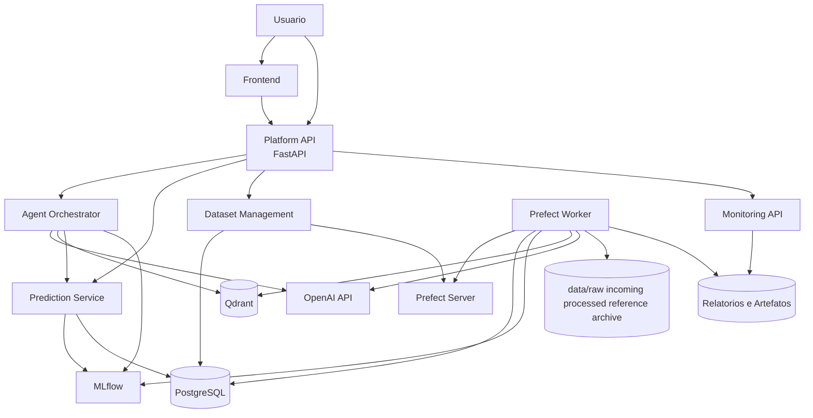
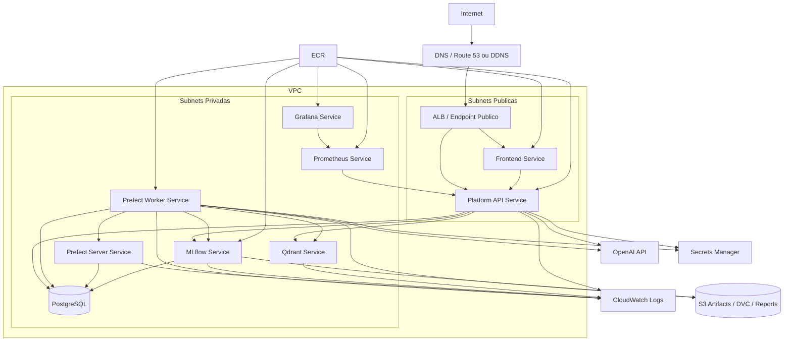

# Arquitetura

Este documento descreve a arquitetura atual da plataforma, já considerando o projeto em estado funcional para demonstração do Datathon.

O sistema foi desenhado como uma plataforma de manutenção preditiva baseada no dataset AI4I 2020. Ele cobre ingestão de dados, engenharia de features, treinamento, registro de modelos, serving, monitoramento, RAG e um assistente com LLM.

## Visão Geral

A solução é dividida em dois grandes blocos:

- **camada online**, responsável por atender chamadas de API, predições e chat;
- **camada offline**, responsável por ingestão, processamento, treinamento, indexação RAG, avaliações e monitoramento agendado.

Na prática, isso aparece assim:

- `platform_api`: serviço FastAPI que expõe os endpoints públicos;
- `prefect-worker`: serviço que executa jobs offline;
- `postgres`: persistência relacional;
- `mlflow`: tracking, registry e governança de modelos;
- `qdrant`: base vetorial do RAG;
- `prometheus` e `grafana`: observabilidade;
- `openai`: LLM do agente e embeddings do RAG.

## Diagrama Lógico

O diagrama abaixo mostra a arquitetura lógica da plataforma, separando a camada online da camada offline e evidenciando como os principais serviços se relacionam.



Nesse desenho:

- a `platform_api` atende o tráfego síncrono;
- o `prefect-worker` executa os fluxos pesados e assíncronos;
- o agente usa OpenAI e pode consultar RAG, modelo e predição;
- o MLflow governa o ciclo de vida dos modelos;
- o PostgreSQL concentra metadados, dados curados e features.

## Diagrama de Infraestrutura AWS

O diagrama abaixo representa uma forma coerente de implantar a solução na AWS usando ECS com Fargate, ECR e separação entre componentes públicos e privados.



Nesse cenário:

- a entrada pública fica concentrada no `ALB`;
- o `frontend` e a `platform_api` são os componentes mais próximos da borda;
- banco, MLflow, Qdrant, Prefect e observabilidade ficam em rede privada;
- as imagens são distribuídas pelo `ECR`;
- segredos ficam fora do código, via `Secrets Manager`;
- artefatos e versões de dados podem ir para `S3`;
- logs operacionais vão para `CloudWatch`.

## Componentes

### Frontend

O projeto já possui um frontend no Docker Compose para consumir a API da plataforma. Ele funciona como camada de interação para demonstração, mas a arquitetura também suporta uso direto via cliente HTTP, Swagger ou integrações externas.

### Platform API

A `platform_api` é o ponto central da camada online. Ela concentra:

- health checks;
- predição de risco de falha;
- consulta ao modelo ativo;
- chat com agente;
- busca RAG;
- status de monitoramento;
- upload e gestão de datasets.

Rotas expostas atualmente:

```text
GET  /api/v1/health
GET  /api/v1/ready
POST /api/v1/chat
POST /api/v1/predictions
GET  /api/v1/machines/dataset/status
POST /api/v1/datasets/upload
GET  /api/v1/datasets/uploads
GET  /api/v1/datasets/batches
GET  /api/v1/datasets/batches/{batch_id}
POST /api/v1/datasets/ingest
POST /api/v1/datasets/retrain
GET  /api/v1/models/{model_name}/active
POST /api/v1/rag/search
GET  /api/v1/monitoring/status
GET  /metrics
```

O Swagger fica em:

```text
/api/v1/docs
```

### Orquestração com Prefect

O Prefect é responsável pela camada offline. Ele executa os fluxos que não devem rodar dentro do request/response da API.

Deployments usados no projeto:

```text
ingest-initial-ai4i-dataset/initial-ai4i-dataset
ingest-incoming-ai4i-batches/incoming-ai4i-batches
train-ai4i-failure-classifier/train-ai4i-failure-classifier
index-rag-documentation/index-rag-documentation
detect-ai4i-drift/detect-ai4i-drift
```

Esse desenho é importante porque mantém a API leve e previsível. Upload de dataset, por exemplo, não treina modelo diretamente. Ele apenas registra o arquivo e pode disparar o deployment de ingestão.

### PostgreSQL

O PostgreSQL é o banco transacional da plataforma. Ele armazena:

- metadados de datasets enviados;
- batches de ingestão;
- dados curados;
- features geradas para modelagem;
- tabelas auxiliares da plataforma.

Além disso, no ambiente local o mesmo serviço PostgreSQL também hospeda os bancos separados usados por:

- Prefect;
- MLflow.

### MLflow

O MLflow é usado para:

- tracking de execuções de treinamento;
- logging de métricas, parâmetros e artefatos;
- registry de modelos;
- governança de promoção.

O pipeline registra o melhor modelo treinado com alias `candidate`. A API de predição consome apenas o alias `champion`.

A promoção de `candidate` para `champion` não é automática. Ela depende de aprovação humana e verificação de artefatos de benchmark e fairness.

### Qdrant e RAG

O Qdrant é a base vetorial da plataforma. Ele armazena embeddings dos documentos do projeto para permitir busca semântica.

Os documentos indexados hoje incluem:

```text
README.md
AGENTS.md
docs/
docs_governance/
```

O RAG não serve para “treinar” o modelo preditivo. Ele existe para dar contexto documental ao agente, permitindo que o chat responda perguntas sobre arquitetura, deploy, segurança, governança, modelo e operação da plataforma.

### Agente com LLM

O chat usa a OpenAI como LLM e trabalha com tool calling. Em vez de responder só com texto livre, o agente pode consultar ferramentas da própria plataforma.

Ferramentas principais:

- busca documental no RAG;
- consulta ao modelo ativo no MLflow;
- predição de risco de falha para uma observação de máquina.

Isso permite uma interação mais útil: o usuário pode perguntar algo como “qual o risco dessa máquina?” e o agente pode realmente chamar a ferramenta de predição, em vez de inventar uma resposta.

### Monitoramento

O monitoramento está dividido em duas frentes:

- monitoramento operacional com Prometheus e Grafana;
- monitoramento de dados com drift baseado em PSI.

A API expõe métricas em `/metrics`. O fluxo de drift gera relatórios em `reports/drift/` e o endpoint `/api/v1/monitoring/status` consegue mostrar o último resumo disponível.

## Fluxo de Dados

### 1. Entrada de dados

O dataset inicial está em:

```text
data/raw/ai4i2020.csv
```

Novos lotes podem entrar de duas formas:

- por upload via API em `POST /api/v1/datasets/upload`;
- por colocação manual de arquivos em `data/incoming/` no ambiente local.

### 2. Validação e ingestão

Quando um CSV novo entra:

1. a API valida o arquivo e registra seus metadados;
2. o arquivo é salvo em `data/incoming/`;
3. o Prefect pode ser acionado para processá-lo;
4. o fluxo de ingestão valida schema, tipos e consistência;
5. os dados curados são gravados no PostgreSQL;
6. o snapshot processado é exportado para `data/processed/`;
7. o arquivo de entrada processado pode ser movido para `data/archive/`.

### 3. Engenharia de features

Durante a ingestão, a plataforma gera features derivadas úteis para manutenção preditiva, como:

- delta de temperatura;
- potência estimada;
- interações entre desgaste, torque e rotação;
- flags ligadas às condições físicas descritas no AI4I.

Essas features alimentam tanto o treinamento quanto a inferência.

### 4. Treinamento

O pipeline de treinamento lê a tabela de features no PostgreSQL e treina múltiplos candidatos. Hoje o projeto já contempla:

- baseline com regressão logística;
- challenger com random forest;
- benchmark com extra trees;
- challenger neural com MLP em PyTorch, quando o runtime possui PyTorch.

O melhor candidato é escolhido com prioridade para `average_precision`, depois recall e F1.

### 5. Registro e promoção

Depois do treinamento:

1. o melhor candidato é registrado no MLflow;
2. recebe alias `candidate`;
3. fica com `approval_status=pending`;
4. benchmark, fairness e explicabilidade servem como evidência;
5. uma promoção manual pode mover o modelo para `champion`.

Esse passo evita que um treinamento novo derrube automaticamente o modelo em produção.

### 6. Serving

Na predição online, a API:

1. recebe uma observação de máquina;
2. aplica a mesma lógica de features usada no treinamento;
3. carrega o modelo `champion` do MLflow;
4. retorna probabilidade de falha, classe de risco e metadados do modelo.

### 7. Assistente

No fluxo do chat:

1. a mensagem passa pelos guardrails;
2. o agente avalia se precisa chamar ferramentas;
3. pode buscar documentação no RAG;
4. pode consultar o modelo ativo;
5. pode pedir uma predição;
6. a saída final também passa por sanitização.

## Segurança na Arquitetura

O agente não possui agência irrestrita. Ele não executa ações operacionais na planta, não promove modelos e não altera infraestrutura.

Controles relevantes já implementados:

- bloqueio de prompt injection;
- restrição de tópico;
- sanitização de segredos e trechos sensíveis na resposta;
- avaliação determinística de segurança;
- promoção manual de modelos;
- escopo limitado de ferramentas no agente.

## Decisões Arquiteturais Importantes

### Separação entre online e offline

A API e o worker possuem imagens separadas. Isso ajuda a manter:

- menor acoplamento entre serving e jobs pesados;
- dependências diferentes por responsabilidade;
- melhor explicação arquitetural para banca;
- possibilidade de escalar serving e processamento de forma independente.

### Upload não implica retreinamento automático

Essa é uma decisão de governança. Entrar com dado novo não significa, por si só, que o melhor caminho é treinar e promover um novo modelo. A plataforma separa:

- ingestão;
- análise de drift;
- treinamento;
- promoção.

### OpenAI como serviço gerenciado

O projeto usa OpenAI na nuvem porque o cenário atual não prevê infraestrutura própria para executar um LLM localmente. Mesmo assim, o restante da arquitetura foi pensado para ser portátil: PostgreSQL, Qdrant, Prefect, MLflow e FastAPI podem rodar localmente ou em cloud.

## Resumo

A arquitetura atual entrega um fluxo completo de plataforma de IA:

- dados entram por upload ou pasta controlada;
- o Prefect processa e organiza a camada offline;
- o PostgreSQL sustenta ingestão e features;
- o MLflow governa o ciclo de vida dos modelos;
- a API serve predição e chat;
- o Qdrant sustenta o RAG;
- Prometheus, Grafana e PSI cobrem observabilidade e drift;
- a promoção do modelo continua sob controle humano.
